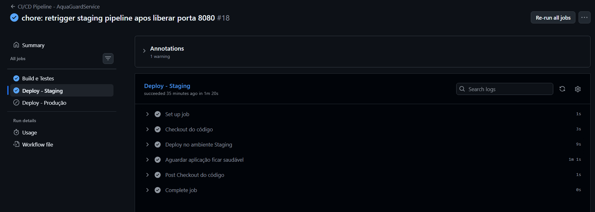
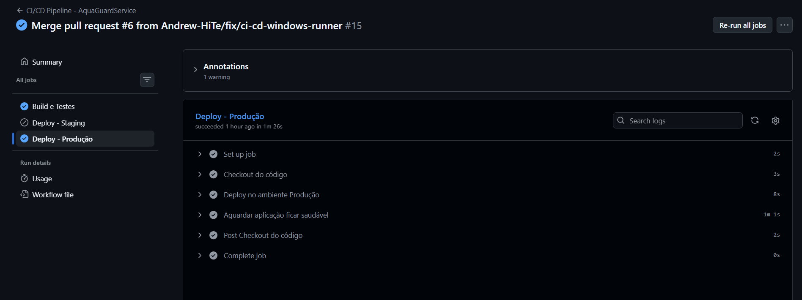
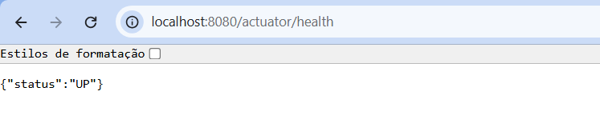
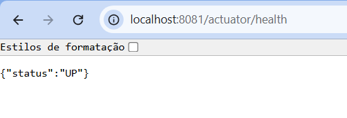
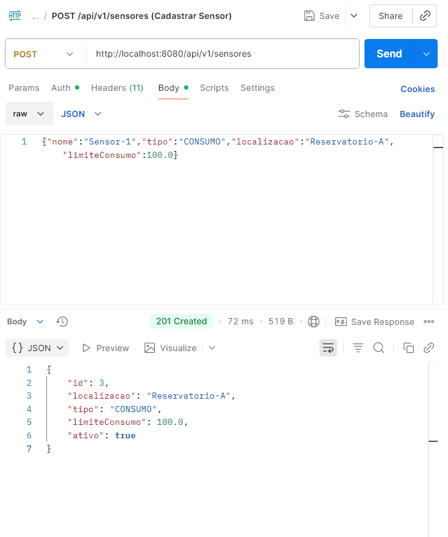
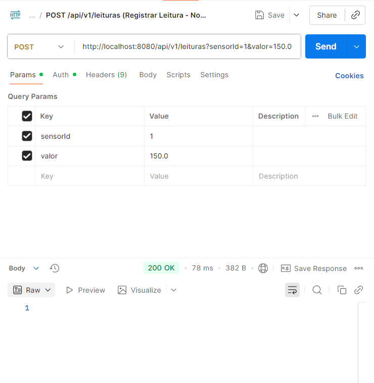
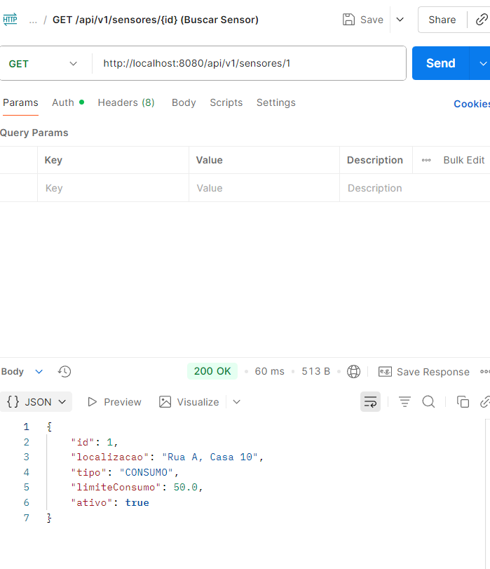

# AquaGuardService — Monitoramento Hídrico ESG

Serviço RESTful em **Spring Boot 3.2 / Java 17** para monitoramento e gestão de recursos hídricos, com pipeline CI/CD completo via GitHub Actions, Docker e testes automatizados.

> **Tema ESG:** Acesso à água e preservação de recursos naturais  
> **Disciplina:** DevOps Tools & Cloud Computing — FIAP

---

## Como executar localmente com Docker

### Pré-requisitos

- [Docker Desktop](https://www.docker.com/products/docker-desktop/) instalado e em execução
- Git

> Java e Maven **não** precisam estar instalados — o build acontece dentro do container (multi-stage).

### Passo a passo

**1. Clonar o repositório**

```bash
git clone https://github.com/Andrew-HiTe/AquaGuardService_Projeto_DEVOPS_FIAP.git
cd AquaGuardService_Projeto_DEVOPS_FIAP
```

**2. Configurar variáveis de ambiente**

```bash
cp .env.example .env
# Edite .env se quiser alterar usuário/senha do banco
```

**3. Subir os containers**

```bash
docker-compose up --build -d
```

> A primeira execução baixa a imagem Oracle XE (~3 GB) e pode demorar alguns minutos.  
> O banco demora ~3 min para ficar pronto — a aplicação aguarda automaticamente via `healthcheck`.

**4. Verificar status**

```bash
docker-compose ps
# Esperado: oracle-db e aquaguard-app com status "Up (healthy)"
```

**5. Acessar a aplicação**

| Serviço | URL |
|---|---|
| API | `http://localhost:8080` |
| Health Check | `http://localhost:8080/actuator/health` |

**6. Parar os containers**

```bash
docker-compose down        # para containers e remove a rede
docker-compose down -v     # também remove o volume do banco
```

---

## Pipeline CI/CD

### Ferramenta utilizada

**GitHub Actions** — definido em `.github/workflows/ci-cd.yml`.

### Funcionamento

O pipeline é acionado por **push** nas branches `main` e `develop`. Possui três jobs:

```
Push → develop ──► [1] Build e Testes ──► [2] Deploy Staging  (self-hosted, porta 8080)
Push → main    ──► [1] Build e Testes ──► [3] Deploy Produção (self-hosted, porta 8081)
```

### Etapas do pipeline

| Job | Runner | Etapas |
|---|---|---|
| **Build e Testes** | `ubuntu-latest` (GitHub-hosted) | checkout → Java 17 + cache Maven → `mvn clean verify` (8 testes) → upload artefatos |
| **Deploy Staging** | `self-hosted` (máquina local) | checkout → `docker compose -f ...staging.yml up -d --build` → health check |
| **Deploy Produção** | `self-hosted` (máquina local) | checkout → `docker compose -f ...production.yml up -d --build` → health check |

### Testes automatizados

Os testes são **unitários com Mockito** (sem banco de dados), garantindo que o job de CI rode em qualquer ambiente GitHub-hosted sem dependências externas.

| Classe de Teste | Cobertura |
|---|---|
| `LeituraServiceTest` | registro de leitura, geração de alertas, exceção para sensor inválido, sensores do tipo vazamento |
| `AlertaServiceTest` | resolução de alerta existente, alerta inexistente, listagem vazia, listagem com dados |

### Ambientes

| Ambiente | Branch | URL | Compose |
|---|---|---|---|
| Staging | `develop` | `http://localhost:8080` | `docker-compose.yml` + `docker-compose.staging.yml` |
| Produção | `main` | `http://localhost:8081` | `docker-compose.yml` + `docker-compose.production.yml` |

---

## Containerização

### Dockerfile (multi-stage build)

```dockerfile
# Estágio 1: Build
FROM maven:3.9.6-eclipse-temurin-17-alpine AS build
WORKDIR /app
COPY pom.xml .
COPY src ./src
RUN mvn clean package -DskipTests

# Estágio 2: Runtime
FROM eclipse-temurin:17-jre-alpine
WORKDIR /app
COPY --from=build /app/target/*.jar app.jar
EXPOSE 8080
ENTRYPOINT ["java", "-jar", "app.jar"]
```

**Estratégias adotadas:**
- **Multi-stage build:** o estágio 1 usa a imagem Maven completa (~600 MB) para compilar; o estágio 2 usa apenas o JRE Alpine (~180 MB), reduzindo a imagem final e a superfície de ataque.
- **Sem dependência de build local:** todo o processo de compilação acontece dentro do container.

### Docker Compose — arquitetura

```
┌──────────────────────── aquaguard-net (bridge) ────────────────────┐
│                                                                      │
│   ┌──────────────────┐           ┌─────────────────────────────┐   │
│   │    oracle-db      │           │       aquaguard-app         │   │
│   │  Oracle XE 21.3  │◄──────────│    Spring Boot 3.2 / Java   │   │
│   │  Porta 1521       │           │    Porta 8080 (staging)     │   │
│   │  Volume:          │           │    Porta 8081 (produção)    │   │
│   │  oracle_data      │           │    /actuator/health         │   │
│   └──────────────────┘           └─────────────────────────────┘   │
└──────────────────────────────────────────────────────────────────────┘
```

**Recursos configurados:**
- **Volumes:** `oracle_data` / `oracle_staging_data` / `oracle_production_data` para persistência do banco
- **Variáveis de ambiente:** `DB_USER`, `DB_PASSWORD` via `.env` / `.env.example`
- **Redes:** rede dedicada `aquaguard-net` isolando os serviços
- **Healthcheck:** Oracle verificado via SQLPlus; App verificada via `/actuator/health`
- **Dependência ordenada:** `aquaguard-app` só sobe após `oracle-db` estar `healthy`

### Ambientes e portas

| Arquivo | Ambiente | Porta App | Porta Oracle |
|---|---|---|---|
| `docker-compose.yml` | Local/dev | 8080 | 1521 |
| `+ docker-compose.staging.yml` | Staging | 8080 | 1521 |
| `+ docker-compose.production.yml` | Produção | 8081 | 1522 |

---

## Prints do funcionamento

### Pipeline GitHub Actions — etapas concluídas

**Staging (deploy em `develop`):** build-and-test + deploy-staging verdes.



**Produção (deploy em `main`):** build-and-test + deploy-production verdes.



### Endpoint `/actuator/health` respondendo

**Staging — `http://localhost:8080/actuator/health`:**



**Produção — `http://localhost:8081/actuator/health`:**



### Endpoints via Postman

**POST `/api/v1/sensores` (admin:adminpass) → 201 Created:**



**POST `/api/v1/leituras?sensorId=1&valor=150.0` → 200 OK (dispara alerta):**



**GET `/api/v1/sensores/1` → 200 OK:**



---

## Tecnologias utilizadas

| Tecnologia | Versão | Finalidade |
|---|---|---|
| Java | 17 | Linguagem principal |
| Spring Boot | 3.2.0 | Framework Web / JPA / Security |
| Spring Actuator | 3.2.0 | Health check e métricas (`/actuator/health`) |
| Oracle XE | 21.3.0 | Banco de dados relacional |
| Flyway | 9.22.3 | Migrations automáticas do banco |
| Docker | 24+ | Containerização da aplicação |
| Docker Compose | 2+ | Orquestração multi-container (app + banco) |
| GitHub Actions | — | Pipeline CI/CD automatizado |
| JUnit 5 + Mockito | — | Testes unitários (8 testes, sem banco) |
| Maven | 3.9.6 | Build e gerenciamento de dependências |

---

## Endpoints da API

| Recurso | Método | Endpoint | Proteção | Descrição |
|---|---|---|---|---|
| Health | `GET` | `/actuator/health` | Pública | Status da aplicação |
| Leitura | `POST` | `/api/v1/leituras` | Pública | Registra leitura de sensor |
| Sensor | `POST` | `/api/v1/sensores` | ADMIN | Cadastra novo sensor |
| Sensor | `GET` | `/api/v1/sensores` | USER | Lista todos os sensores |
| Alerta | `GET` | `/api/v1/alertas` | USER | Lista todos os alertas |
| Alerta | `PUT` | `/api/v1/alertas/{id}/resolver` | ADMIN | Resolve um alerta |
| Relatório | `GET` | `/api/v1/relatorios/consumo-mensal/{sensorId}` | USER | Relatório mensal |

**Credenciais de teste (Basic Auth):**

| Usuário | Senha | Papéis |
|---|---|---|
| `admin` | `adminpass` | `ADMIN`, `USER` |
| `user` | `userpass` | `USER` |

> Importe `AquaGuardService_Postman_Collection.json` no Postman para testar todos os endpoints.

---

## Checklist de Entrega

| Item | OK |
|---|---|
| Projeto compactado em .ZIP com estrutura organizada | ☑ |
| Dockerfile funcional | ☑ |
| docker-compose.yml ou arquivos Kubernetes | ☑ |
| Pipeline com etapas de build, teste e deploy | ☑ |
| README.md com instruções e prints | ☑ |
| Documentação técnica com evidências (PDF ou PPT) | ☑ |
| Deploy realizado nos ambientes staging e produção | ☑ |
